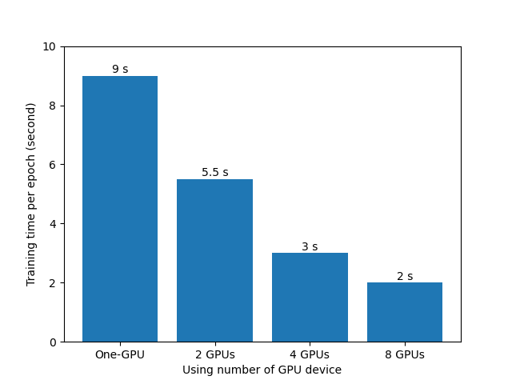
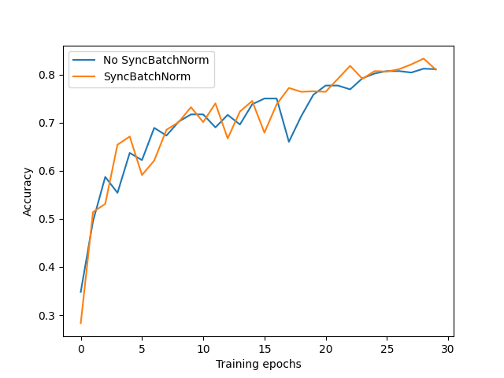
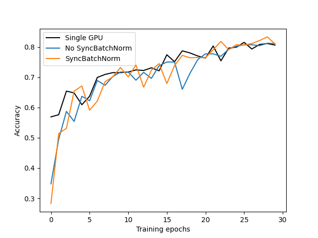

## 多GPU启动指令
- 如果要使用```train_multi_gpu_using_launch.py```脚本，使用以下指令启动
- ```python -m torch.distributed.launch --nproc_per_node=8 --use_env train_multi_gpu_using_launch.py```
- 其中```nproc_per_node```为并行GPU的数量
- 如果要指定使用某几块GPU可使用如下指令，例如使用第1块和第4块GPU进行训练：
- ```CUDA_VISIBLE_DEVICES=0,3 python -m torch.distributed.launch --nproc_per_node=2 --use_env train_multi_gpu_using_launch.py```

-----

- 如果要使用```train_multi_gpu_using_spawn.py```脚本，使用以下指令启动
- ```python train_multi_gpu_using_spawn.py```

## 训练时间对比


## 是否使用SyncBatchNorm


## 单GPU与多GPU训练曲线

