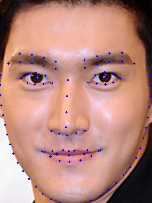

# DeepPose
## 对应论文
论文名称：`DeepPose: Human Pose Estimation via Deep Neural Networks`  
论文arxiv链接：[https://arxiv.org/abs/1312.4659](https://arxiv.org/abs/1312.4659)

## 开发环境
开发环境主要信息如下，其他Python依赖详情可见`requirements.txt`文件
- Python3.10
- torch2.0.1+cu118（建议大于等于此版本）
- torchvision0.15.2+cu118（建议大于等于此版本）

## 训练数据集准备
该项目采用的训练数据是WFLW数据集（人脸98点检测），官方链接：[https://wywu.github.io/projects/LAB/WFLW.html](https://wywu.github.io/projects/LAB/WFLW.html)

在官方网页下载数据集后解压并组织成如下目录形式：
```
WFLW
 ├── WFLW_annotations
 │   ├── list_98pt_rect_attr_train_test
 │   └── list_98pt_test
 └── WFLW_images
     ├── 0--Parade
     ├── 1--Handshaking
     ├── 10--People_Marching
     ├── 11--Meeting
     ├── 12--Group
     └── ......
```

## 预训练权重准备
由于该项目默认使用的backbone是torchvision中的resnet50，在实例化模型时会自动下载在imagenet上的预训练权重。
- 若训练环境可正常联网，则会自动下载预训练权重
- 若训练环境无法正常链接网络，可预先在联网的机器上手动下载，下载链接：[https://download.pytorch.org/models/resnet50-11ad3fa6.pth](https://download.pytorch.org/models/resnet50-11ad3fa6.pth) 下载完成后将权重拷贝至训练服务器的`~/.cache/torch/hub/checkpoints`目录下即可

## 启动训练
将训练脚本中的`--dataset_dir`设置成自己构建的`WFLW`数据集绝对路径，例如`/home/wz/datasets/WFLW`
### 单卡训练
使用`train.py`脚本：
```bash
python train.py
```
### 多卡训练
使用`train_multi_GPU.py`脚本：
```
torchrun --nproc_per_node=8 train_multi_GPU.py
```
若要单独指定使用某些卡可在启动指令前加入`CUDA_VISIBLE_DEVICES`参数，例如：
```
CUDA_VISIBLE_DEVICES=4,5,6,7 torchrun --nproc_per_node=4 train_multi_GPU.py
```

## 训练好的权重下载地址
若没有训练条件或者只想简单体验下，可使用本人训练好的模型权重（包含optimizer等信息故文件会略大），该权重在WFLW验证集上的NME指标为`0.048`，百度网盘下载地址：[https://pan.baidu.com/s/1L_zg-fmocEyzhSTxj8IDJw](https://pan.baidu.com/s/1L_zg-fmocEyzhSTxj8IDJw) 
提取码：8fux

下载完成后在当前项目下创建一个`weights`文件夹，并将权重放置该文件夹内。

## 测试图片
可参考`predict.py`文件，将`img_path`设置成自己要预测的人脸图片（注意这里只支持单人脸的关键点检测，故需要提供单独的人脸图片，具体使用时可配合一个人脸检测器联合使用），例如输入图片：


网络预测可视化结果为：



## 导出ONNX模型（可选）
若需要导出ONNX模型可使用`export_onnx.py`脚本。