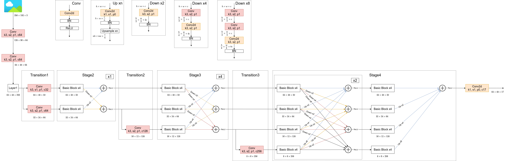

# HRNet

## 该项目主要参考以下仓库
* https://github.com/leoxiaobin/deep-high-resolution-net.pytorch
* https://github.com/stefanopini/simple-HRNet

## 环境配置：
* Python3.6/3.7/3.8
* Pytorch1.10或以上
* pycocotools(Linux:`pip install pycocotools`; Windows:`pip install pycocotools-windows`(不需要额外安装vs))
* Ubuntu或Centos(不建议Windows)
* 最好使用GPU训练
* 详细环境配置见`requirements.txt`

## 文件结构：
```
  ├── model: 搭建HRNet相关代码
  ├── train_utils: 训练验证相关模块（包括coco验证相关）
  ├── my_dataset_coco.py: 自定义dataset用于读取COCO2017数据集
  ├── person_keypoints.json: COCO数据集中人体关键点相关信息
  ├── train.py: 单GPU/CPU训练脚本
  ├── train_multi_GPU.py: 针对使用多GPU的用户使用
  ├── predict.py: 简易的预测脚本，使用训练好的权重进行预测
  ├── validation.py: 利用训练好的权重验证/测试数据的COCO指标，并生成record_mAP.txt文件
  └── transforms.py: 数据增强相关
```

## 预训练权重下载地址（下载后放入当前文件夹中）：
由于原作者提供的预训练权重(Imagenet和COCO)是放在GoogleDrive和OneDrive上的，国内无法正常访问。所有我提前将权重文件全部下载并放在百度网盘中，
需要的可以自行下载，链接:https://pan.baidu.com/s/1Lu6mMAWfm_8GGykttFMpVw 提取码:f43o

下载后的目录结构如下：
```
├── pytorch
      ├── pose_mpii
      ├── pose_coco
      │     ├── pose_resnet_50_384x288.pth
      │     ├── pose_resnet_50_256x192.pth
      │     ├── pose_resnet_101_384x288.pth
      │     ├── pose_resnet_101_256x192.pth
      │     ├── pose_hrnet_w32_384x288.pth
      │     └── pose_hrnet_w32_256x192.pth
      └── imagenet
            ├── resnet50-19c8e357.pth
            ├── resnet152-b121ed2d.pth
            ├── resnet101-5d3b4d8f.pth
            └── hrnet_w32-36af842e.pth
```
如果要直接使用在COCO数据集上预训练好的权重进行预测，下载pose_coco下的`pose_hrnet_w32_256x192.pth`使用即可。
如果要从头训练网络，下载imagenet下的`hrnet_w32-36af842e.pth`文件，并重命名为`hrnet_w32.pth`即可。

除此之外，还有一个`person_detection_results`文件，存储的是论文中提到的人体检测器的检测结果，如果需要使用可以下载，但个人建议直接使用COCO val中GT信息即可。
链接: https://pan.baidu.com/s/19Z4mmNHUD934GQ9QYcF5iw  密码: i08q
 
## 数据集，本例程使用的是COCO2017数据集
* COCO官网地址：https://cocodataset.org/
* 对数据集不了解的可以看下我写的博文：https://blog.csdn.net/qq_37541097/article/details/113247318
* 这里以下载coco2017数据集为例，主要下载三个文件：
    * `2017 Train images [118K/18GB]`：训练过程中使用到的所有图像文件
    * `2017 Val images [5K/1GB]`：验证过程中使用到的所有图像文件
    * `2017 Train/Val annotations [241MB]`：对应训练集和验证集的标注json文件
* 都解压到`coco2017`文件夹下，可得到如下文件夹结构：
```
├── coco2017: 数据集根目录
     ├── train2017: 所有训练图像文件夹(118287张)
     ├── val2017: 所有验证图像文件夹(5000张)
     └── annotations: 对应标注文件夹
              ├── instances_train2017.json: 对应目标检测、分割任务的训练集标注文件
              ├── instances_val2017.json: 对应目标检测、分割任务的验证集标注文件
              ├── captions_train2017.json: 对应图像描述的训练集标注文件
              ├── captions_val2017.json: 对应图像描述的验证集标注文件
              ├── person_keypoints_train2017.json: 对应人体关键点检测的训练集标注文件
              └── person_keypoints_val2017.json: 对应人体关键点检测的验证集标注文件夹
```

## 训练方法
* 注：该项目从头训练HRNet在MS COCO2017的val上的mAP[@0.50:0.95]为76.1，利用原作者提供的权重在val上的mAP[@0.50:0.95]为76.6，相差0.5个点，
暂时没有找到原因。由于训练该网络需要迭代210个epoch(按照论文中的数据)，训练时间很长，建议直接使用原作者提供训练好的权重。另外，在训练过程中发现GPU的利用率
并不高(在20%~60%之间浮动)，暂时猜测是网络结构的原因。
* 确保提前准备好数据集
* 确保提前下载好对应预训练模型权重
* 确保设置好`--num-joints`(对于人体检测的关键点个数，COCO是17个点)、`--fixed-size`(输入目标图像的高宽，默认[256, 192])和`--data-path`(指向`coco2017`目录)
* 若要使用单GPU训练直接使用train.py训练脚本
* 若要使用多GPU训练，使用`torchrun --nproc_per_node=8 train_multi_GPU.py`指令,`nproc_per_node`参数为使用GPU数量
* 如果想指定使用哪些GPU设备可在指令前加上`CUDA_VISIBLE_DEVICES=0,3`(例如我只要使用设备中的第1块和第4块GPU设备)
* `CUDA_VISIBLE_DEVICES=0,3 torchrun --nproc_per_node=2 train_multi_GPU.py`

## 注意事项
1. 在使用训练脚本时，注意要将`--data-path`设置为自己存放数据集的**根目录**：
假设要使用COCO数据集，启用自定义数据集读取CocoDetection并将数据集解压到成/data/coco2017目录下
```
python train.py --data-path /data/coco2017
```
2. 训练过程中保存的`results.txt`是每个epoch在验证集上的COCO指标，前10个值是COCO指标，后面两个值是训练平均损失以及学习率
3. 在使用预测脚本时，如果要读取自己训练好的权重要将`weights_path`设置为你自己生成的权重路径。


## 如果对HRNet网络不是很理解可参考我的bilibili
https://www.bilibili.com/video/BV1bB4y1y7qP

## 进一步了解该项目，以及对HRNet代码的分析可参考我的bilibili
https://www.bilibili.com/video/BV1ar4y157JM

## HRNet网络结构图

