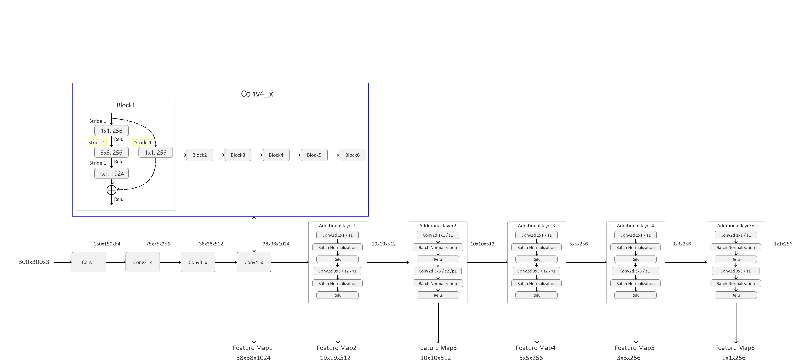

# SSD: Single Shot MultiBox Detector

## 环境配置：
* Python 3.6/3.7/3.8
* Pytorch 1.7.1
* pycocotools(Linux:```pip install pycocotools```; Windows:```pip install pycocotools-windows```(不需要额外安装vs))
* Ubuntu或Centos(不建议Windows)
* 最好使用GPU训练

## 文件结构：
```
├── src: 实现SSD模型的相关模块    
│     ├── resnet50_backbone.py   使用resnet50网络作为SSD的backbone  
│     ├── ssd_model.py           SSD网络结构文件 
│     └── utils.py               训练过程中使用到的一些功能实现
├── train_utils: 训练验证相关模块（包括cocotools）  
├── my_dataset.py: 自定义dataset用于读取VOC数据集    
├── train_ssd300.py: 以resnet50做为backbone的SSD网络进行训练    
├── train_multi_GPU.py: 针对使用多GPU的用户使用    
├── predict_test.py: 简易的预测脚本，使用训练好的权重进行预测测试    
├── pascal_voc_classes.json: pascal_voc标签文件    
├── plot_curve.py: 用于绘制训练过程的损失以及验证集的mAP
└── validation.py: 利用训练好的权重验证/测试数据的COCO指标，并生成record_mAP.txt文件
```

## 预训练权重下载地址（下载后放入src文件夹中）：
* ResNet50+SSD: https://ngc.nvidia.com/catalog/models  
 `搜索ssd -> 找到SSD for PyTorch(FP32) -> download FP32 -> 解压文件`
* 如果找不到可通过百度网盘下载，链接:https://pan.baidu.com/s/1byOnoNuqmBLZMDA0-lbCMQ 提取码:iggj 

## 数据集，本例程使用的是PASCAL VOC2012数据集(下载后放入项目当前文件夹中)
* Pascal VOC2012 train/val数据集下载地址：http://host.robots.ox.ac.uk/pascal/VOC/voc2012/VOCtrainval_11-May-2012.tar
* Pascal VOC2007 test数据集请参考：http://host.robots.ox.ac.uk/pascal/VOC/voc2007/VOCtest_06-Nov-2007.tar
* 如果不了解数据集或者想使用自己的数据集进行训练，请参考我的bilibili：https://b23.tv/F1kSCK

## 训练方法
* 确保提前准备好数据集
* 确保提前下载好对应预训练模型权重
* 单GPU训练或CPU，直接使用train_ssd300.py训练脚本
* 若要使用多GPU训练，使用 "python -m torch.distributed.launch --nproc_per_node=8 --use_env train_multi_GPU.py" 指令,nproc_per_node参数为使用GPU数量
* 训练过程中保存的`results.txt`是每个epoch在验证集上的COCO指标，前12个值是COCO指标，后面两个值是训练平均损失以及学习率

## 如果对SSD算法原理不是很理解可参考我的bilibili
* https://www.bilibili.com/video/BV1fT4y1L7Gi

## 进一步了解该项目，以及对SSD算法代码的分析可参考我的bilibili
* https://www.bilibili.com/video/BV1vK411H771/

## Resnet50 + SSD算法框架图
 
