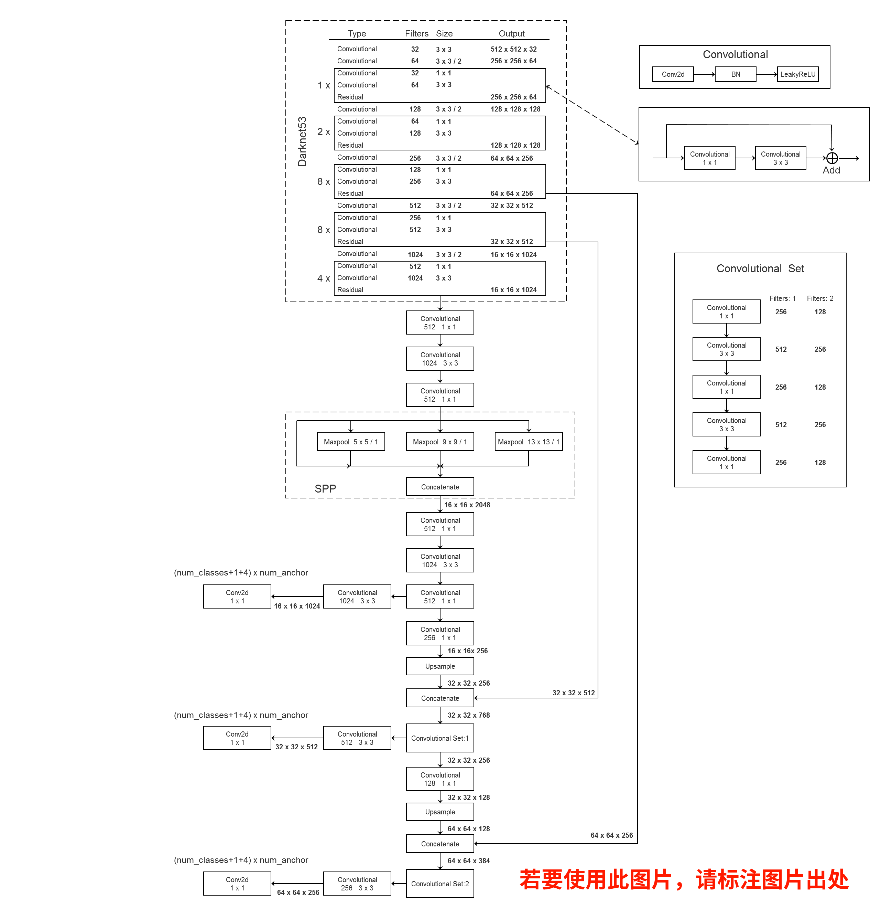

# YOLOv3 SPP
## 该项目源自[ultralytics/yolov3](https://github.com/ultralytics/yolov3)
## 1 环境配置：
* Python3.6或者3.7
* Pytorch1.6(注意：必须是1.6.0或以上，因为使用官方提供的混合精度训练1.6.0后才支持)
* pycocotools(Linux: ```pip install pycocotools```;   
  Windows: ```pip install pycocotools-windows```(不需要额外安装vs))
* 更多环境配置信息，请查看```requirements.txt```文件
* 最好使用GPU训练

## 2 文件结构：
```
  ├── cfg: 配置文件目录
  │    ├── hyp.yaml: 训练网络的相关超参数
  │    └── yolov3-spp.cfg: yolov3-spp网络结构配置 
  │ 
  ├── data: 存储训练时数据集相关信息缓存
  │    └── pascal_voc_classes.json: pascal voc数据集标签
  │ 
  ├── runs: 保存训练过程中生成的所有tensorboard相关文件
  ├── build_utils: 搭建训练网络时使用到的工具
  │     ├── datasets.py: 数据读取以及预处理方法
  │     ├── img_utils.py: 部分图像处理方法
  │     ├── layers.py: 实现的一些基础层结构
  │     ├── parse_config.py: 解析yolov3-spp.cfg文件
  │     ├── torch_utils.py: 使用pytorch实现的一些工具
  │     └── utils.py: 训练网络过程中使用到的一些方法
  │
  ├── train_utils: 训练验证网络时使用到的工具(包括多GPU训练以及使用cocotools)
  ├── weights: 所有相关预训练权重(下面会给出百度云的下载地址)
  ├── model.py: 模型搭建文件
  ├── train.py: 针对单GPU或者CPU的用户使用
  ├── train_multi_GPU.py: 针对使用多GPU的用户使用
  ├── trans_voc2yolo.py: 将voc数据集标注信息(.xml)转为yolo标注格式(.txt)
  ├── calculate_dataset.py: 1)统计训练集和验证集的数据并生成相应.txt文件
  │                         2)创建data.data文件
  │                         3)根据yolov3-spp.cfg结合数据集类别数创建my_yolov3.cfg文件
  └── predict_test.py: 简易的预测脚本，使用训练好的权重进行预测测试
```

## 3 训练数据的准备以及目录结构
* 这里建议标注数据时直接生成yolo格式的标签文件```.txt```，推荐使用免费开源的标注软件(支持yolo格式)，[https://github.com/tzutalin/labelImg](https://github.com/tzutalin/labelImg)
* 如果之前已经标注成pascal voc的```.xml```格式了也没关系，我写了个voc转yolo格式的转化脚本，4.1会讲怎么使用
* 测试图像时最好将图像缩放到32的倍数
* 标注好的数据集请按照以下目录结构进行摆放:
```
├── my_yolo_dataset 自定义数据集根目录
│         ├── train   训练集目录
│         │     ├── images  训练集图像目录
│         │     └── labels  训练集标签目录 
│         └── val    验证集目录
│               ├── images  验证集图像目录
│               └── labels  验证集标签目录            
```

## 4 利用标注好的数据集生成一系列相关准备文件，为了方便我写了个脚本，通过脚本可直接生成。也可参考原作者的[教程](https://github.com/ultralytics/yolov3/wiki/Train-Custom-Data)
```
├── data 利用数据集生成的一系列相关准备文件目录
│    ├── my_train_data.txt:  该文件里存储的是所有训练图片的路径地址
│    ├── my_val_data.txt:  该文件里存储的是所有验证图片的路径地址
│    ├── my_data_label.names:  该文件里存储的是所有类别的名称，一个类别对应一行(这里会根据```.json```文件自动生成)
│    └── my_data.data:  该文件里记录的是类别数类别信息、train以及valid对应的txt文件
```

### 4.1 将VOC标注数据转为YOLO标注数据(如果你的数据已经是YOLO格式了，可跳过该步骤)
* 使用```trans_voc2yolo.py```脚本进行转换，并在```./data/```文件夹下生成```my_data_label.names```标签文件，
* 执行脚本前，需要根据自己的路径修改以下参数
```python
# voc数据集根目录以及版本
voc_root = "./VOCdevkit"
voc_version = "VOC2012"

# 转换的训练集以及验证集对应txt文件，对应VOCdevkit/VOC2012/ImageSets/Main文件夹下的txt文件
train_txt = "train.txt"
val_txt = "val.txt"

# 转换后的文件保存目录
save_file_root = "/home/wz/my_project/my_yolo_dataset"

# label标签对应json文件
label_json_path = './data/pascal_voc_classes.json'
```
* 生成的```my_data_label.names```标签文件格式如下
```text
aeroplane
bicycle
bird
boat
bottle
bus
...
```

### 4.2 根据摆放好的数据集信息生成一系列相关准备文件
* 使用```calculate_dataset.py```脚本生成```my_train_data.txt```文件、```my_val_data.txt```文件以及```my_data.data```文件，并生成新的```my_yolov3.cfg```文件
* 执行脚本前，需要根据自己的路径修改以下参数
```python
# 训练集的labels目录路径
train_annotation_dir = "/home/wz/my_project/my_yolo_dataset/train/labels"
# 验证集的labels目录路径
val_annotation_dir = "/home/wz/my_project/my_yolo_dataset/val/labels"
# 上一步生成的my_data_label.names文件路径(如果没有该文件，可以自己手动编辑一个txt文档，然后重命名为.names格式即可)
classes_label = "./data/my_data_label.names"
# 原始yolov3-spp.cfg网络结构配置文件
cfg_path = "./cfg/yolov3-spp.cfg"
```

## 5 预训练权重下载地址（下载后放入weights文件夹中）：
* ```yolov3-spp-ultralytics-416.pt```: 链接: https://pan.baidu.com/s/1cK3USHKxDx-d5dONij52lA  密码: r3vm
* ```yolov3-spp-ultralytics-512.pt```: 链接: https://pan.baidu.com/s/1k5yeTZZNv8Xqf0uBXnUK-g  密码: e3k1
* ```yolov3-spp-ultralytics-608.pt```: 链接: https://pan.baidu.com/s/1GI8BA0wxeWMC0cjrC01G7Q  密码: ma3t
* ```yolov3spp-voc-512.pt``` **(这是我在视频演示训练中得到的权重)**: 链接: https://pan.baidu.com/s/1aFAtaHlge0ieFtQ9nhmj3w  密码: 8ph3
 
 
## 6 数据集，本例程使用的是PASCAL VOC2012数据集
* ```Pascal VOC2012``` train/val数据集下载地址：http://host.robots.ox.ac.uk/pascal/VOC/voc2012/VOCtrainval_11-May-2012.tar
* 如果不了解数据集或者想使用自己的数据集进行训练，请参考我的bilibili：https://b23.tv/F1kSCK

## 7 使用方法
* 确保提前准备好数据集
* 确保提前下载好对应预训练模型权重
* 若要使用单GPU训练或者使用CPU训练，直接使用train.py训练脚本
* 若要使用多GPU训练，使用```python -m torch.distributed.launch --nproc_per_node=8 --use_env train_multi_GPU.py```指令,```nproc_per_node```参数为使用GPU数量

## 如果对YOLOv3 SPP网络原理不是很理解可参考我的bilibili
[https://www.bilibili.com/video/BV1yi4y1g7ro?p=3](https://www.bilibili.com/video/BV1yi4y1g7ro?p=3)

## 进一步了解该项目，以及对YOLOv3 SPP代码的分析可参考我的bilibili
[https://www.bilibili.com/video/BV1t54y1C7ra](https://www.bilibili.com/video/BV1t54y1C7ra)

## YOLOv3 SPP框架图
 
