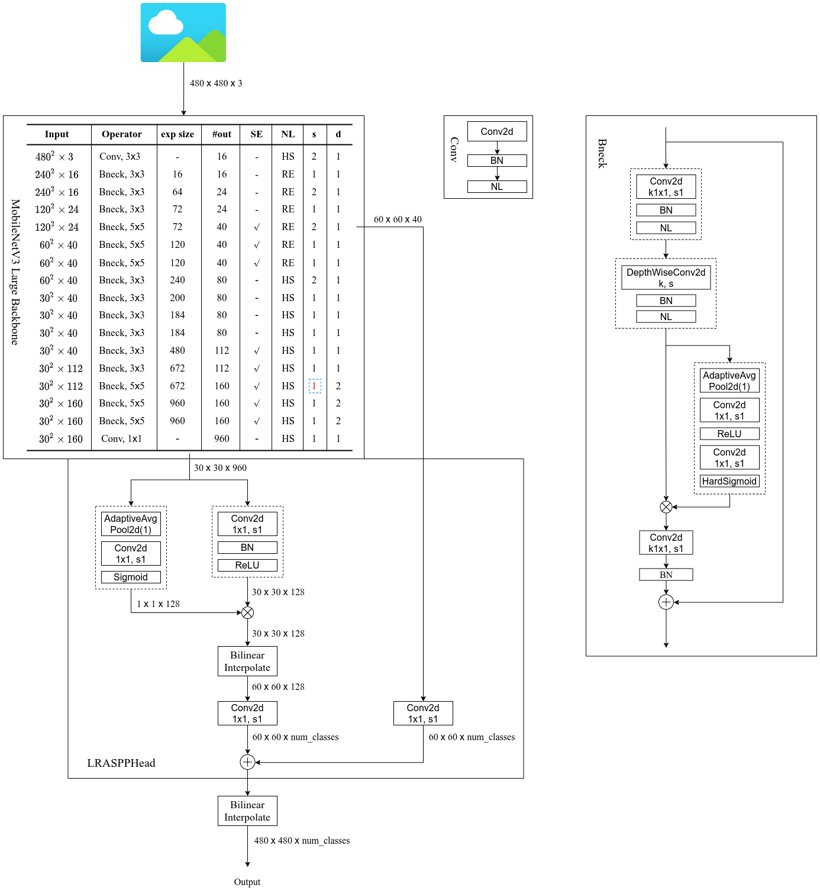

# LRASPP(Searching for MobileNetV3)

## 该项目主要是来自pytorch官方torchvision模块中的源码
* https://github.com/pytorch/vision/tree/main/torchvision/models/segmentation

## 环境配置：
* Python3.6/3.7/3.8
* Pytorch1.10
* Ubuntu或Centos(Windows暂不支持多GPU训练)
* 最好使用GPU训练
* 详细环境配置见```requirements.txt```

## 文件结构：
```
  ├── src: 模型的backbone以及LRASPP的搭建
  ├── train_utils: 训练、验证以及多GPU训练相关模块
  ├── my_dataset.py: 自定义dataset用于读取VOC数据集
  ├── train.py: 单GPU训练脚本
  ├── train_multi_GPU.py: 针对使用多GPU的用户使用
  ├── predict.py: 简易的预测脚本，使用训练好的权重进行预测测试
  ├── validation.py: 利用训练好的权重验证/测试数据的mIoU等指标，并生成record_mAP.txt文件
  └── pascal_voc_classes.json: pascal_voc标签文件
```

## 预训练权重下载地址：
* 注意：官方提供的预训练权重是在COCO上预训练得到的，训练时只针对和PASCAL VOC相同的类别进行了训练，所以类别数是21(包括背景)
* lraspp_mobilenet_v3_large: https://download.pytorch.org/models/lraspp_mobilenet_v3_large-d234d4ea.pth
* 注意，下载的预训练权重记得要重命名，比如在train.py中读取的是```lraspp_mobilenet_v3_large.pth```文件，
  不是```lraspp_mobilenet_v3_large-d234d4ea.pth```
 
 
## 数据集，本例程使用的是PASCAL VOC2012数据集
* Pascal VOC2012 train/val数据集下载地址：http://host.robots.ox.ac.uk/pascal/VOC/voc2012/VOCtrainval_11-May-2012.tar
* 如果不了解数据集或者想使用自己的数据集进行训练，请参考我的博文: https://blog.csdn.net/qq_37541097/article/details/115787033

## 训练方法
* 确保提前准备好数据集
* 确保提前下载好对应预训练模型权重
* 若要使用单GPU或者CPU训练，直接使用train.py训练脚本
* 若要使用多GPU训练，使用```torchrun --nproc_per_node=8 train_multi_GPU.py```指令,```nproc_per_node```参数为使用GPU数量
* 如果想指定使用哪些GPU设备可在指令前加上```CUDA_VISIBLE_DEVICES=0,3```(例如我只要使用设备中的第1块和第4块GPU设备)
* ```CUDA_VISIBLE_DEVICES=0,3 torchrun --nproc_per_node=2 train_multi_GPU.py```

## 注意事项
* 在使用训练脚本时，注意要将'--data-path'(VOC_root)设置为自己存放'VOCdevkit'文件夹所在的**根目录**
* 在使用预测脚本时，要将'weights_path'设置为你自己生成的权重路径。
* 使用validation文件时，注意确保你的验证集或者测试集中必须包含每个类别的目标，并且使用时只需要修改'--num-classes'、'--data-path'和'--weights'即可，其他代码尽量不要改动

## 如果对LRASPP原理不是很理解可参考我的bilibili
LR-ASPP网络讲解: [https://www.bilibili.com/video/BV1LS4y1M76E](https://www.bilibili.com/video/BV1LS4y1M76E)

## 进一步了解该项目，以及对LRASPP代码的分析可参考我的bilibili
LR-ASPP源码解析(Pytorch版): [https://www.bilibili.com/video/bv13D4y1F7ML](https://www.bilibili.com/video/bv13D4y1F7ML)

## Pytorch官方实现的LRASPP网络框架图

