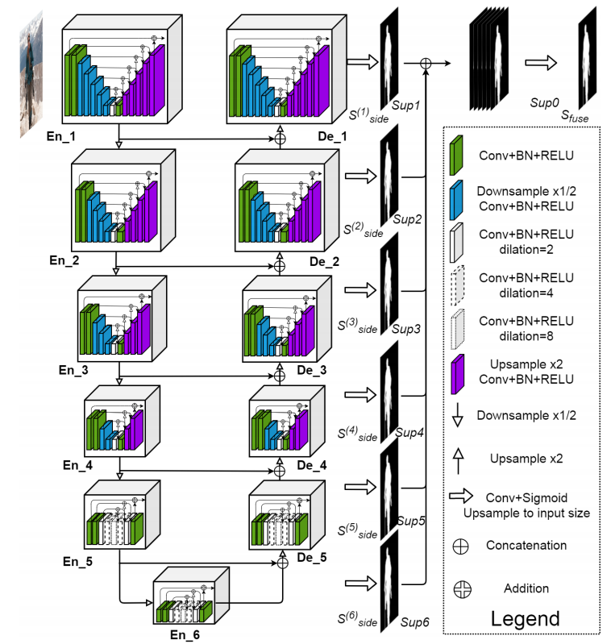

# U2-Net(Going Deeper with Nested U-Structure for Salient Object Detection)

## 该项目主要是来自官方的源码
- https://github.com/xuebinqin/U-2-Net
- 注意，该项目是针对显著性目标检测领域（Salient Object Detection / SOD）

## 环境配置：
- Python3.6/3.7/3.8
- Pytorch1.10
- Ubuntu或Centos(Windows暂不支持多GPU训练)
- 建议使用GPU训练
- 详细环境配置见`requirements.txt`


## 文件结构
```
├── src: 搭建网络相关代码
├── train_utils: 训练以及验证相关代码
├── my_dataset.py: 自定义数据集读取相关代码
├── predict.py: 简易的预测代码
├── train.py: 单GPU或CPU训练代码
├── train_multi_GPU.py: 多GPU并行训练代码
├── validation.py: 单独验证模型相关代码
├── transforms.py: 数据预处理相关代码
└── requirements.txt: 项目依赖
```

## DUTS数据集准备
- DUTS数据集官方下载地址：[http://saliencydetection.net/duts/](http://saliencydetection.net/duts/)
- 如果下载不了，可以通过我提供的百度云下载，链接: https://pan.baidu.com/s/1nBI6GTN0ZilqH4Tvu18dow  密码: r7k6
- 其中DUTS-TR为训练集，DUTS-TE是测试（验证）集，数据集解压后目录结构如下：
```
├── DUTS-TR
│      ├── DUTS-TR-Image: 该文件夹存放所有训练集的图片
│      └── DUTS-TR-Mask: 该文件夹存放对应训练图片的GT标签（Mask蒙板形式）
│
└── DUTS-TE
       ├── DUTS-TE-Image: 该文件夹存放所有测试（验证）集的图片
       └── DUTS-TE-Mask: 该文件夹存放对应测试（验证）图片的GT标签（Mask蒙板形式）
```
- 注意训练或者验证过程中，将`--data-path`指向`DUTS-TR`所在根目录

## 官方权重
从官方转换得到的权重：
- `u2net_full.pth`下载链接: https://pan.baidu.com/s/1ojJZS8v3F_eFKkF3DEdEXA  密码: fh1v
- `u2net_lite.pth`下载链接: https://pan.baidu.com/s/1TIWoiuEz9qRvTX9quDqQHg  密码: 5stj

`u2net_full`在DUTS-TE上的验证结果(使用`validation.py`进行验证)：
```
MAE: 0.044
maxF1: 0.868
```
**注：**
- 这里的maxF1和原论文中的结果有些差异，经过对比发现差异主要来自post_norm，原仓库中会对预测结果进行post_norm，但在本仓库中将post_norm给移除了。
如果加上post_norm这里的maxF1为`0.872`，如果需要做该后处理可自行添加，post_norm流程如下，其中output为验证时网络预测的输出：
```python
ma = torch.max(output)
mi = torch.min(output)
output = (output - mi) / (ma - mi)
```
- 如果要载入官方提供的权重，需要将`src/model.py`中`ConvBNReLU`类里卷积的bias设置成True，因为官方代码里没有进行设置（Conv2d的bias默认为True）。
因为卷积后跟了BN，所以bias是起不到作用的，所以在本仓库中默认将bias设置为False。

## 训练记录(`u2net_full`)
训练指令：
```
torchrun --nproc_per_node=4 train_multi_GPU.py --lr 0.004 --amp
```
训练最终在DUTS-TE上的验证结果：
```
MAE: 0.047
maxF1: 0.859
```
训练过程详情可见results.txt文件，训练权重下载链接: https://pan.baidu.com/s/1df2jMkrjbgEv-r1NMaZCZg  密码: n4l6

## 训练方法
* 确保提前准备好数据集
* 若要使用单GPU或者CPU训练，直接使用train.py训练脚本
* 若要使用多GPU训练，使用`torchrun --nproc_per_node=8 train_multi_GPU.py`指令,`nproc_per_node`参数为使用GPU数量
* 如果想指定使用哪些GPU设备可在指令前加上`CUDA_VISIBLE_DEVICES=0,3`(例如我只要使用设备中的第1块和第4块GPU设备)
* `CUDA_VISIBLE_DEVICES=0,3 torchrun --nproc_per_node=2 train_multi_GPU.py`

## 如果对U2Net网络不了解的可参考我的bilibili
- [https://www.bilibili.com/video/BV1yB4y1z7m](https://www.bilibili.com/video/BV1yB4y1z7m)

## 进一步了解该项目，以及对U2Net代码的分析可参考我的bilibili
- [https://www.bilibili.com/video/BV1Kt4y137iS](https://www.bilibili.com/video/BV1Kt4y137iS)

## U2NET网络结构
